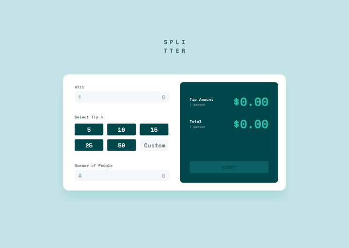
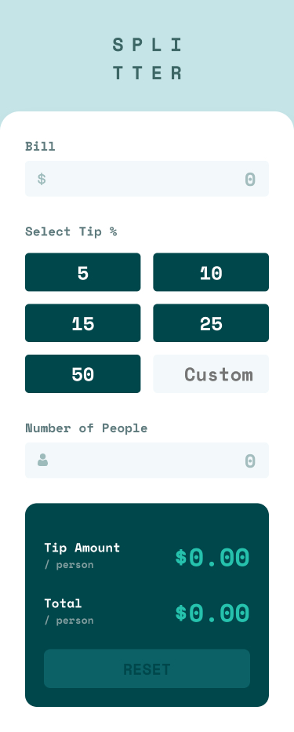

# Frontend Mentor - Tip calculator app solution

This is Max Ruuen's solution to the [Tip calculator app challenge on Frontend Mentor](https://www.frontendmentor.io/challenges/tip-calculator-app-ugJNGbJUX). Frontend Mentor challenges help you improve your coding skills by building realistic projects.

## Table of contents

- [Overview](#overview)
  - [The challenge](#the-challenge)
  - [Screenshot](#screenshot)
  - [Links](#links)
- [Built with](#built-with)
- [Author](#author)

## Overview

### The challenge

Users should be able to:

- View the optimal layout for the app depending on their device's screen size
- See hover states for all interactive elements on the page
- Calculate the correct tip and total cost of the bill per person

### Screenshot

#### Desktop Layout

#### Mobile Layout

### Links

- Solution URL: [Frontendmentor]()
- Live Site URL: [Netlify](https://rd-challenge-tip-calculator.netlify.app/)

## Built with

- React
- SCSS
- CSS Grid & Flex

## Author

- Frontend Mentor - [@ruuendigital](https://www.frontendmentor.io/profile/yourusername)
- Twitter - [@maxruuen](https://www.twitter.com/maxruuen)
